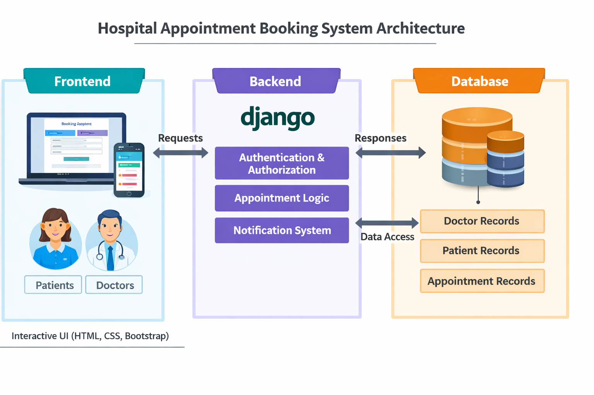
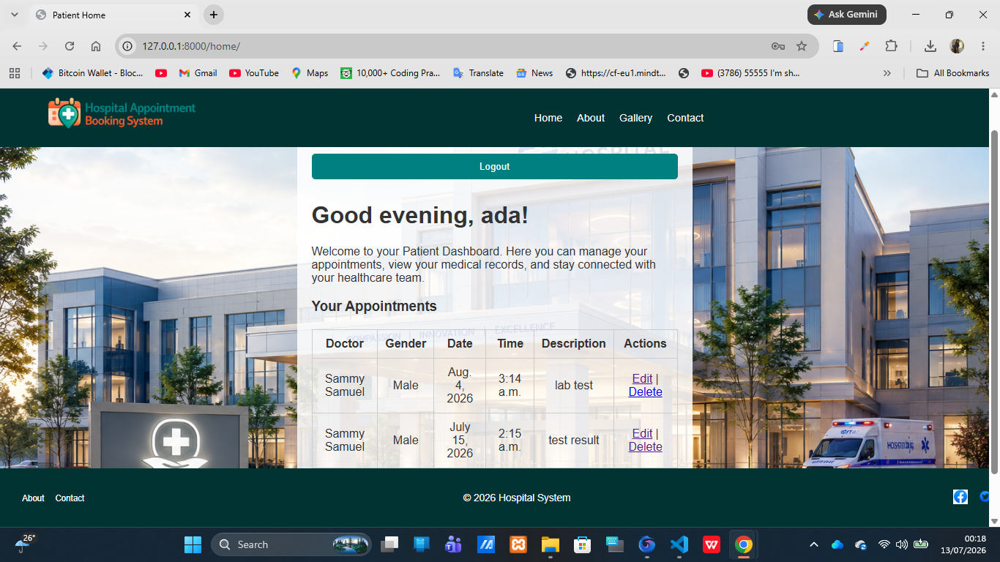
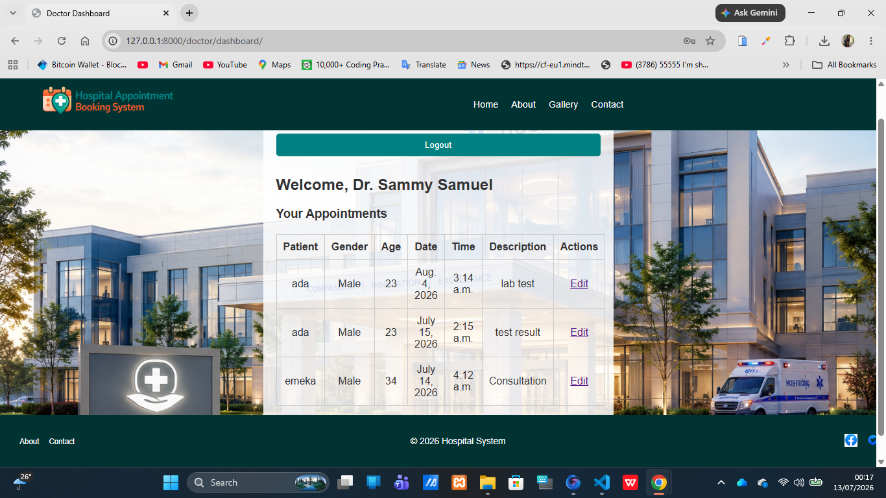
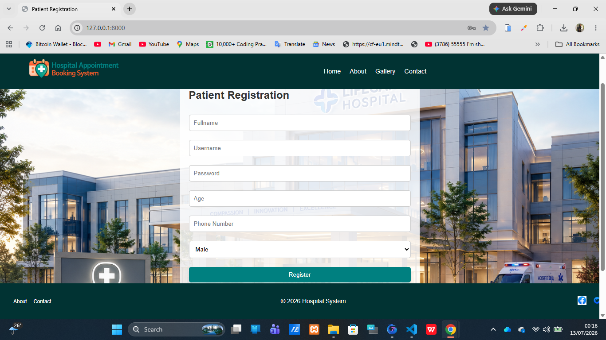
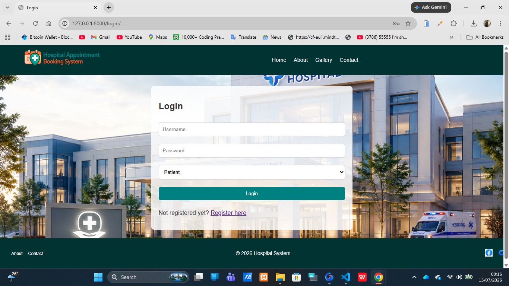
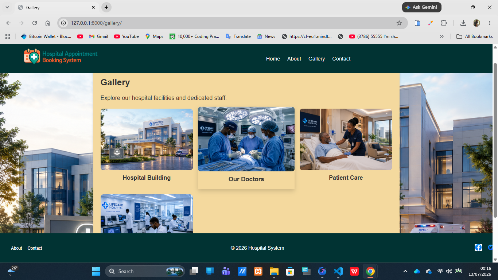

# 🏥 Hospital Appointment Booking System

A Django-based web application that streamlines hospital workflows by enabling patients to register, book, update, and cancel appointments, while doctors manage schedules via a secure dashboard.

---

## 🚀 Features
- **Role-based login** for doctors and patients  
- **Patient registration** with age, gender, and contact details  
- **Appointment booking** with date, time, and description  
- **Update & cancel appointments** for both patients and doctors  
- **Doctor dashboard** to view and manage schedules  
- **Responsive UI** with clean navigation and footer  

---

## 🛠️ Tech Stack
- **Backend:** Django, SQLite  
- **Frontend:** HTML, CSS, Bootstrap  
- **Authentication:** Django Auth with role-based routing  

---

## 📂 Project Structure
- `Hospital/` → Templates and static files  
- `models.py` → Doctor, Patient, Appointment models  
- `views.py` → Role-based views and appointment logic  
- `urls.py` → Routing for patients and doctors  

---

## ⚡ Getting Started
1. Clone the repo:  
   ```bash
   git clone https://github.com/yourusername/HospitalAppointment_BookingSystem.git


---

## 🏗️ System Architecture




The diagram illustrates:
- **Frontend:** Patients & doctors interact via responsive UI (HTML, CSS, Bootstrap).
- **Backend:** Django handles authentication, appointment logic, and notifications.
- **Database:** Stores doctor, patient, and appointment records.


## 📸 Screenshots:

<p align="center">
  
  
  
  
  
</p>

## 📜 License
This project is licensed under the MIT License — see the [LICENSE](LICENSE) file for details.
